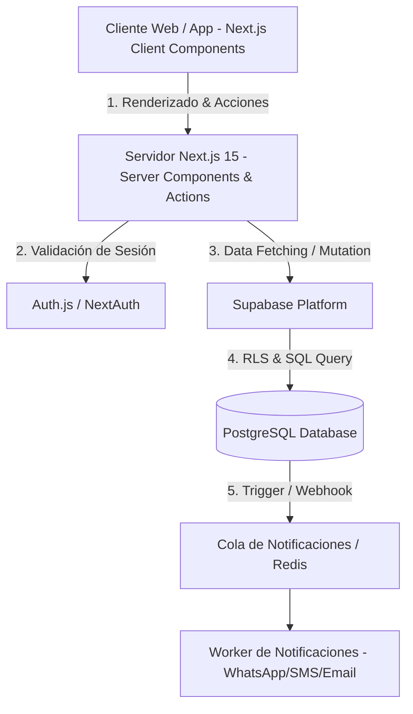
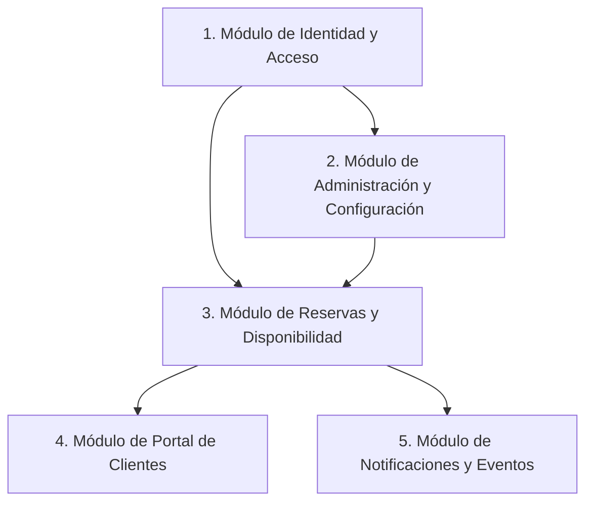
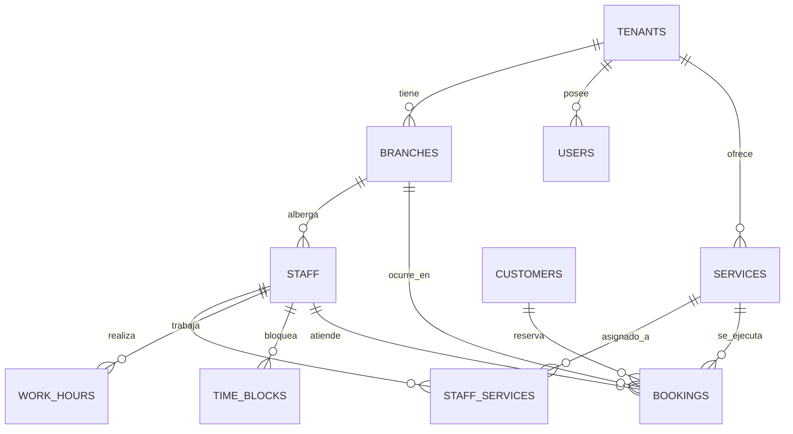
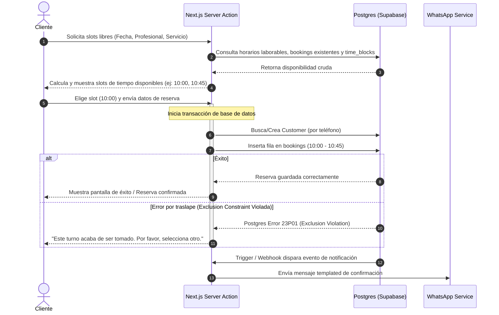

# Arquitectura y Diseño de Sistema de Reservas SaaS (Barbería y Cosmetología)

Este documento detalla el diseño de arquitectura, modelo de datos y estrategias de escalabilidad para un sistema de reservas multi-inquilino (SaaS) adaptado a centros de estética, barberías y cosmetología facial.

---

## 1. Arquitectura General del Sistema

El sistema sigue una arquitectura moderna **Serverless-First** con renderizado híbrido y desacoplamiento de capas mediante **Next.js 15** (App Router) y **Supabase** (como Backend-as-a-Service basado en PostgreSQL).



### Decisiones Técnicas Clave (Justificación de Staff Engineer)

*   **Next.js 15 (App Router, Server Components y Server Actions):**
    *   *Justificación:* El portal de reservas público (donde los clientes finales eligen turnos) se beneficia enormemente de la velocidad y el SEO que ofrecen los Server Components. Por el contrario, el dashboard del negocio requiere interactividad en tiempo real (calendarios interactivos). Next.js nos permite mezclar de manera fluida Server Components (para velocidad y SEO de la landing de reserva) con Client Components reactivos. Las Server Actions reducen el boilerplate de crear APIs REST tradicionales para cada mutación.
*   **Tenencia Lógica (Single DB, Multi-Tenant vía Row-Level Security - RLS):**
    *   *Justificación:* Para un MVP escalable a SaaS, utilizar múltiples bases de datos físicas o esquemas por cliente añade una sobrecarga operativa y costos prohibitivos. La tenencia lógica con un campo `tenant_id` compartido y políticas de **Row-Level Security (RLS)** en PostgreSQL garantiza el aislamiento estricto de datos con costo de infraestructura cero por tenant adicional. RLS se ejecuta a nivel de motor de base de datos, evitando que un desarrollador olvide un `WHERE tenant_id = x` en la capa de aplicación.
*   **Integración Auth.js (NextAuth) con Supabase RLS:**
    *   *Justificación:* Auth.js nos da una flexibilidad absoluta para implementar OAuth (Google, Facebook) y Login con Passwordless (Magic Links) para clientes. Para comunicar la sesión de Auth.js a Supabase y respetar RLS, firmamos un token JWT de Supabase en el callback `jwt` de Auth.js utilizando la firma secreta de Supabase (`SUPABASE_JWT_SECRET`). Este JWT incluye el `tenant_id` y el `role` del usuario. Cuando el servidor de Next.js consulta a Supabase, pasa este JWT, permitiendo al motor de Postgres evaluar las políticas de RLS de forma nativa.

---

## 2. Módulos del Sistema

El sistema se divide en 5 módulos acoplados de forma débil (loosely coupled) a través del esquema de base de datos y eventos de aplicación.



1.  **Módulo de Identidad y Acceso (Auth & Roles):**
    *   Gestión de perfiles (Admin, Recepcionista, Profesional, Cliente).
    *   Control de acceso basado en roles (RBAC) heredado por RLS en la base de datos.
2.  **Módulo de Administración (Tenancy & Config):**
    *   Parámetros del Tenant (nombre del negocio, branding, logo, subdominio).
    *   Gestión de sucursales (sucursales físicas, dirección, zona horaria).
    *   Catálogo de Servicios (duración, precio, margen de tiempo/buffer post-servicio, sucursal disponible).
    *   Staff y Horarios de Trabajo (días laborales, rangos horarios, breaks, bloqueos puntuales).
3.  **Módulo de Reservas y Disponibilidad (Booking Engine):**
    *   Motor de cálculo de franjas horarias (slots) libres.
    *   Controlador de reservas (creación, edición, cancelación, inasistencias/no-show).
    *   Motor de concurrencia y bloqueo temporal de slots durante el checkout.
4.  **Módulo del Portal de Clientes (Customer Front):**
    *   Landing page de reservas pública optimizada para móviles (90% del tráfico de barberías/cosmetología).
    *   Flujo paso a paso: Selección de servicio -> profesional -> fecha y hora -> datos de contacto -> confirmación.
    *   Historial de turnos y cancelación con políticas flexibles del negocio.
5.  **Módulo de Notificaciones y Eventos (Notification Engine):**
    *   Recordatorios automáticos vía WhatsApp/SMS (canales con mayor tasa de apertura en estética).
    *   Envío de correos de confirmación/cancelación.
    *   Activado de forma asíncrona mediante Webhooks de Supabase o colas de tareas.

---

## 3. Relaciones entre Módulos

La comunicación entre módulos sigue patrones limpios de dependencia unidireccional para mantener el sistema mantenible:

*   **Configuración a Reservas:** El motor de reservas depende directamente de la configuración (horarios de staff, servicios activos y sucursales) para generar los slots de tiempo disponibles.
*   **Reservas a Notificaciones:** La creación o modificación de una reserva dispara un evento. En el MVP, usamos **Supabase Webhooks** que escuchan inserts/updates en la tabla `bookings` y llaman a un Endpoint de Next.js (o Edge Function) que envía la notificación a un servicio de mensajería (Twilio/Wassenger) de forma asíncrona. Esto evita bloquear el hilo de ejecución del cliente que realiza la reserva.
*   **Identidad a Todos:** Cada operación verifica la identidad y rol del usuario actual. En operaciones públicas (reservas de clientes no registrados), se asume el rol `anon`, permitiendo inserciones controladas pero bloqueando lecturas de datos sensibles de otros clientes.

---

## 4. Principales Entidades (Esquema PostgreSQL)

El diseño de datos está optimizado para consultas de disponibilidad eficientes y aislamiento robusto de inquilinos (`tenant_id`).



### Código SQL de Definición de Tablas (DDL)

```sql
-- Habilitar extensión para exclusiones de rangos (vital para concurrencia)
CREATE EXTENSION IF NOT EXISTS btree_gist;

-- 1. Inquilinos (SaaS Tenants)
CREATE TABLE tenants (
    id UUID PRIMARY KEY DEFAULT gen_random_uuid(),
    name VARCHAR(255) NOT NULL,
    subdomain VARCHAR(100) UNIQUE NOT NULL,
    branding_color VARCHAR(7) DEFAULT '#000000',
    created_at TIMESTAMP WITH TIME ZONE DEFAULT CURRENT_TIMESTAMP
);

-- 2. Sucursales (Branches)
CREATE TABLE branches (
    id UUID PRIMARY KEY DEFAULT gen_random_uuid(),
    tenant_id UUID NOT NULL REFERENCES tenants(id) ON DELETE CASCADE,
    name VARCHAR(255) NOT NULL,
    address TEXT,
    timezone VARCHAR(100) NOT NULL DEFAULT 'America/Argentina/Buenos_Aires',
    created_at TIMESTAMP WITH TIME ZONE DEFAULT CURRENT_TIMESTAMP
);
CREATE INDEX idx_branches_tenant ON branches(tenant_id);

-- 3. Usuarios de la Plataforma (Auth.js compatible + Roles)
CREATE TYPE user_role AS ENUM ('superadmin', 'admin', 'receptionist', 'staff', 'customer');

CREATE TABLE users (
    id UUID PRIMARY KEY DEFAULT gen_random_uuid(),
    tenant_id UUID REFERENCES tenants(id) ON DELETE CASCADE, -- NULL para superadmins
    email VARCHAR(255) UNIQUE NOT NULL,
    name VARCHAR(255) NOT NULL,
    role user_role NOT NULL DEFAULT 'customer',
    created_at TIMESTAMP WITH TIME ZONE DEFAULT CURRENT_TIMESTAMP
);
CREATE INDEX idx_users_tenant ON users(tenant_id);

-- 4. Servicios (Services)
CREATE TABLE services (
    id UUID PRIMARY KEY DEFAULT gen_random_uuid(),
    tenant_id UUID NOT NULL REFERENCES tenants(id) ON DELETE CASCADE,
    name VARCHAR(255) NOT NULL,
    description TEXT,
    price DECIMAL(10,2) NOT NULL,
    duration_minutes INT NOT NULL, -- Duración del servicio
    buffer_time_minutes INT DEFAULT 0, -- Tiempo de limpieza/preparación post-servicio
    is_active BOOLEAN DEFAULT TRUE,
    created_at TIMESTAMP WITH TIME ZONE DEFAULT CURRENT_TIMESTAMP
);
CREATE INDEX idx_services_tenant ON services(tenant_id);

-- 5. Personal / Profesionales (Staff)
CREATE TABLE staff (
    id UUID PRIMARY KEY DEFAULT gen_random_uuid(),
    tenant_id UUID NOT NULL REFERENCES tenants(id) ON DELETE CASCADE,
    branch_id UUID NOT NULL REFERENCES branches(id) ON DELETE CASCADE,
    user_id UUID UNIQUE REFERENCES users(id) ON DELETE SET NULL, -- Enlace a login si es necesario
    name VARCHAR(255) NOT NULL,
    email VARCHAR(255),
    phone VARCHAR(50),
    is_active BOOLEAN DEFAULT TRUE,
    created_at TIMESTAMP WITH TIME ZONE DEFAULT CURRENT_TIMESTAMP
);
CREATE INDEX idx_staff_branch ON staff(branch_id);

-- Tabla intermedia: Qué profesional hace qué servicio
CREATE TABLE staff_services (
    staff_id UUID REFERENCES staff(id) ON DELETE CASCADE,
    service_id UUID REFERENCES services(id) ON DELETE CASCADE,
    PRIMARY KEY (staff_id, service_id)
);

-- 6. Horarios de Trabajo del Personal (Work Hours)
CREATE TABLE work_hours (
    id UUID PRIMARY KEY DEFAULT gen_random_uuid(),
    staff_id UUID NOT NULL REFERENCES staff(id) ON DELETE CASCADE,
    day_of_week INT NOT NULL CHECK (day_of_week BETWEEN 0 AND 6), -- 0=Domingo, 6=Sábado
    start_time TIME NOT NULL,
    end_time TIME NOT NULL,
    is_active BOOLEAN DEFAULT TRUE,
    CONSTRAINT chk_hours_order CHECK (start_time < end_time)
);
CREATE INDEX idx_work_hours_staff ON work_hours(staff_id);

-- 7. Bloqueos de Agenda / Excepciones (Vacaciones, Almuerzo, Feriados)
CREATE TABLE time_blocks (
    id UUID PRIMARY KEY DEFAULT gen_random_uuid(),
    staff_id UUID NOT NULL REFERENCES staff(id) ON DELETE CASCADE,
    start_time TIMESTAMP WITH TIME ZONE NOT NULL,
    end_time TIMESTAMP WITH TIME ZONE NOT NULL,
    reason VARCHAR(255),
    CONSTRAINT chk_block_order CHECK (start_time < end_time)
);
CREATE INDEX idx_time_blocks_staff ON time_blocks(staff_id);

-- 8. Clientes Finales (Customers)
CREATE TABLE customers (
    id UUID PRIMARY KEY DEFAULT gen_random_uuid(),
    tenant_id UUID NOT NULL REFERENCES tenants(id) ON DELETE CASCADE,
    name VARCHAR(255) NOT NULL,
    email VARCHAR(255),
    phone VARCHAR(50) NOT NULL, -- WhatsApp / SMS principal
    created_at TIMESTAMP WITH TIME ZONE DEFAULT CURRENT_TIMESTAMP
);
CREATE UNIQUE INDEX idx_customers_tenant_phone ON customers(tenant_id, phone);

-- 9. Reservas (Bookings)
CREATE TYPE booking_status AS ENUM ('pending', 'confirmed', 'cancelled', 'completed', 'no_show');

CREATE TABLE bookings (
    id UUID PRIMARY KEY DEFAULT gen_random_uuid(),
    tenant_id UUID NOT NULL REFERENCES tenants(id) ON DELETE CASCADE,
    branch_id UUID NOT NULL REFERENCES branches(id) ON DELETE CASCADE,
    customer_id UUID NOT NULL REFERENCES customers(id) ON DELETE CASCADE,
    staff_id UUID NOT NULL REFERENCES staff(id) ON DELETE CASCADE,
    service_id UUID NOT NULL REFERENCES services(id) ON DELETE CASCADE,
    status booking_status NOT NULL DEFAULT 'confirmed',
    start_time TIMESTAMP WITH TIME ZONE NOT NULL,
    end_time TIMESTAMP WITH TIME ZONE NOT NULL, -- Calculado automáticamente: start_time + service.duration + service.buffer_time
    notes TEXT,
    price_charged DECIMAL(10,2) NOT NULL,
    created_at TIMESTAMP WITH TIME ZONE DEFAULT CURRENT_TIMESTAMP,
    CONSTRAINT chk_booking_order CHECK (start_time < end_time)
);

CREATE INDEX idx_bookings_search ON bookings(tenant_id, branch_id, staff_id, start_time, end_time);
```

### Mitigación de Concurrencia a Nivel Base de Datos (Double Booking)

> [!IMPORTANT]
> En un sistema de reservas, la condición de carrera (race condition) donde dos clientes seleccionan el mismo horario con el mismo profesional al mismo tiempo es el reto técnico crítico.

Para resolverlo sin depender de locks en memoria de la aplicación (los cuales fallan al escalar horizontalmente Next.js), aplicamos una **Exclusion Constraint** en PostgreSQL. Esto garantiza integridad transaccional (ACID) directa en la base de datos:

```sql
-- Restricción de exclusión para evitar solapamiento de reservas para el mismo profesional
ALTER TABLE bookings ADD CONSTRAINT no_overlapping_bookings
EXCLUDE USING gist (
  staff_id WITH =,
  tstzrange(start_time, end_time) WITH &&
) WHERE (status NOT IN ('cancelled', 'no_show'));
```

**Explicación:** Esta regla impide que dos filas tengan el mismo `staff_id` (`=`) y que sus rangos de tiempo se intersecten (`&&`). Si dos transacciones intentan confirmar concurrentemente, la segunda fallará inmediatamente con un error de violación de restricción, el cual capturamos en Next.js Server Actions para notificar al usuario final de manera elegante.

---

## 5. Flujo de Reservas (Secuencia Técnica)

El flujo está diseñado para minimizar pasos y asegurar una experiencia rápida en dispositivos móviles.



---

## 6. Escalabilidad Futura (Roadmap a SaaS Enterprise)

El diseño propuesto permite transicionar de un MVP local a un SaaS global con mínimas modificaciones de infraestructura:

1.  **Multi-Tenancy vía Subdominios Dinámicos / Dominios Personalizados:**
    *   *Implementación:* En Next.js 15, utilizamos un `middleware.ts` en el nivel raíz. Este middleware extrae el subdominio de la petición (ej: `barberiafigaro.turnosapp.com`).
    *   *Comportamiento:* Reescribe internamente la ruta hacia `/tenants/[tenantSubdomain]/...` de forma transparente para el usuario final.
    *   *Resolución de Tenant:* En el servidor, consultamos la tabla `tenants` buscando por `subdomain` para obtener el `tenant_id` inicial y pasar los claims correspondientes al cliente de Supabase.
2.  **Particionado de Base de Datos (Database Sharding) y Réplicas de Lectura:**
    *   *Fase Intermedia:* Dado que todas las tablas importantes referencian a `tenant_id`, la base de datos está perfectamente estructurada para **Particionamiento Declarativo de Postgres** basado en el valor de la clave `tenant_id`.
    *   *Fase Enterprise:* Si un tenant escala masivamente (ej: una gran cadena con 100 sucursales), sus datos pueden migrarse a un shard físico exclusivo de base de datos sin alterar la lógica de negocio de la aplicación Next.js.
3.  **Timezone Engine:**
    *   *Desafío:* La cosmetología facial y las barberías suelen estar localizadas, pero al volverse SaaS, tendremos sucursales en diferentes zonas horarias.
    *   *Solución:* Guardamos todos los timestamps de reservas en la base de datos en UTC. Cada sucursal (`branches`) tiene una columna `timezone` (ej: `America/Argentina/Buenos_Aires`). El motor de cálculo procesa la disponibilidad en la zona horaria de la sucursal y la envía formateada al cliente.

---

## 7. Posibles Cuellos de Botella y Mitigaciones

### A. Cálculo Complejo de Disponibilidad (Time-Slotting Algorithm)
*   **Problema:** Calcular slots disponibles en tiempo real requiere cruzar:
    1. Horas laborales del profesional en el día de la semana (`work_hours`).
    2. Bloqueos manuales y ausencias del profesional en ese día (`time_blocks`).
    3. Reservas ya agendadas de ese profesional (`bookings`).
    4. Duración + buffer del servicio que se quiere cotizar.
*   **Solución Staff:** Implementar esta lógica en una **PostgreSQL Stored Procedure (RPC)** en Supabase en lugar de traer todos los datos y calcularlos en Next.js. Postgres está hiper-optimizado para operaciones de conjuntos y cálculo de intersecciones temporales.
    *   *Estrategia:* Una función Postgres `get_available_slots(p_staff_id, p_service_id, p_date)` devuelve directamente un array de rangos disponibles (`tsrange[]`). Esto ahorra ancho de banda de red y reduce el consumo de memoria en las Serverless Functions de Next.js.

### B. Límites de Conexiones a Base de Datos en Arquitecturas Serverless
*   **Problema:** Al usar Next.js con Serverless Actions/Functions, cada invocación puede abrir una nueva conexión a PostgreSQL. Con picos de tráfico repentinos, la base de datos puede quedarse rápidamente sin descriptores de conexión disponibles.
*   **Solución Staff:**
    *   Utilizar **Supavisor** (el Connection Pooler nativo de Supabase) en modo **Transaction Pooler** para la base de datos transaccional. Esto permite que miles de serverless functions compartan eficientemente un pool pequeño de conexiones reales (ej: 20 conexiones persistentes a Postgres).

### C. Latencia en Notificaciones Externas
*   **Problema:** Si el flujo de reserva espera a que la API de WhatsApp o Twilio responda antes de retornar éxito al cliente, la latencia percibida subirá en más de 1.5 - 2 segundos.
*   **Solución Staff:** Desacoplar las notificaciones del flujo transaccional de reserva. La inserción de la reserva es inmediata. Un webhook de base de datos asíncrono o un worker de cola en segundo plano procesa la cola de envíos de WhatsApp sin bloquear la interacción del cliente.

---

## 8. Justificaciones Técnicas Adicionales (Perspectiva de Negocio y Operación)

*   **¿Por qué Tailwind y Shadcn UI?**
    *   *Enfoque MVP a SaaS:* Permite crear un sistema de diseño altamente personalizable y coherente desde el día uno. Dado que Shadcn UI copia el código fuente directamente en tu proyecto (`/components/ui`), podemos extender los componentes fácilmente para soportar múltiples temas visuales basados en la marca del tenant (inyectando variables CSS dinámicas basadas en `branding_color` del tenant de la BD).
*   **¿Por qué Auth.js sobre Supabase Auth nativo en este stack?**
    *   *Flexibilidad del Stack:* Auth.js (NextAuth) se integra de manera ideal con el ecosistema de Next.js 15 Middleware y nos otorga independencia si en el futuro decidimos cambiar el backend (por ejemplo, migrar de Supabase a un PostgreSQL auto-alojado en AWS RDS o Neon). Mantenemos la lógica de negocio y sesión unificada bajo estándares web y OAuth abiertos.
