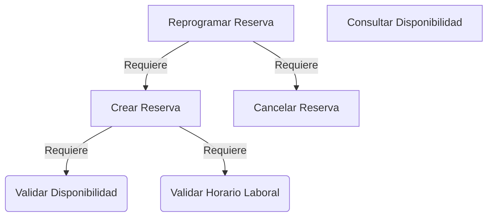
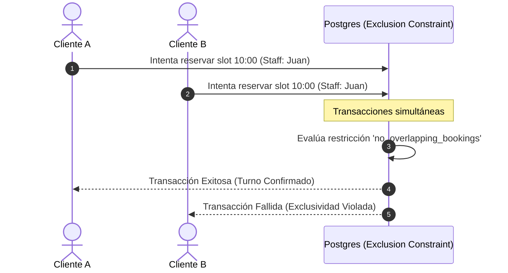

# Diseño de Lógica de Negocio y Backend: Sistema de Reservas

Este documento detalla la lógica de negocio, validaciones y estrategias de concurrencia para el motor de reservas del sistema SaaS.

---

## 1. Casos de Uso del Sistema (Use Cases)

Los casos de uso representan las operaciones atómicas que el sistema expone para resolver las necesidades del negocio.



### A. `CrearReservaUseCase`
*   **Actor:** Cliente (público) o Recepcionista/Admin (interno).
*   **Entrada:** `tenant_id`, `branch_id`, `customer_id` (o datos para crearlo), `staff_id`, `service_id`, `start_time` (UTC).
*   **Salida:** `Booking` creado o error detallado.
*   **Flujo Principal:**
    1. Obtener la duración y buffer del servicio. Calcular `end_time = start_time + duration_minutes + buffer_time_minutes`.
    2. Validar que la sucursal y el profesional estén activos.
    3. Validar políticas de tiempo del negocio (ej: no reservar en el pasado, límite de antelación).
    4. Validar que el rango `[start_time, end_time]` caiga enteramente dentro del horario laboral del profesional en su sucursal.
    5. Validar que no existan traslapes con otras reservas activas del mismo profesional ni bloqueos manuales (`time_blocks`).
    6. Registrar al cliente si no existe.
    7. Insertar la reserva con estado `confirmed` (o `pending` si requiere aprobación/pago de seña).
    8. Disparar evento de integración `booking.confirmed` para notificaciones.

### B. `CancelarReservaUseCase`
*   **Actor:** Cliente, Recepcionista, Admin o el propio Profesional.
*   **Entrada:** `booking_id`, `reason`, `requested_by` (ID del usuario solicitante).
*   **Flujo Principal:**
    1. Obtener los detalles de la reserva.
    2. Si el solicitante es un **Cliente**, validar la política de cancelación del negocio (ej: permitida hasta 4 horas antes del turno). Si se viola, el estado pasa a `cancelled` pero se puede marcar para penalización (no-show o cobro de seña).
    3. Cambiar el estado de la reserva a `cancelled`.
    4. Disparar evento `booking.cancelled` (libera el slot en tiempo real y notifica al staff).

### C. `ReprogramarReservaUseCase`
*   **Actor:** Cliente, Recepcionista o Admin.
*   **Entrada:** `booking_id`, `new_start_time`.
*   **Flujo Principal:**
    1. Iniciar transacción de base de datos.
    2. Obtener la reserva actual.
    3. Validar políticas de reprogramación (ej: antelación mínima).
    4. Cancelar lógicamente la reserva actual (cambiar estado temporal a `cancelled_for_reschedule` para liberar el slot).
    5. Ejecutar la lógica de `CrearReservaUseCase` con el nuevo horario.
    6. Si la creación del nuevo turno falla por solapamiento o regla de negocio, revertir la transacción completa (Rollback) para mantener el turno original intacto.
    7. Si tiene éxito, confirmar transacción (Commit) y disparar evento `booking.rescheduled`.

---

## 2. Servicios de Dominio (Domain Services)

Son servicios sin estado que encapsulan lógica de negocio compleja que no pertenece a una sola entidad.

### A. `AvailabilityService`
Responsable del motor de cálculo de disponibilidad. Su función principal es **generar las ventanas de tiempo disponibles** para una fecha, profesional y servicio específicos.
*   **Método `calculateFreeSlots(staffId, serviceId, date)`**:
    1. Obtiene las horas de trabajo del staff para el día de la semana correspondiente (`work_hours`).
    2. Obtiene las reservas activas y bloqueos (`time_blocks`) para ese staff en la fecha indicada.
    3. Genera slots potenciales basados en un intervalo configurable (ej: cada 15 o 30 minutos).
    4. Para cada slot, comprueba si cabe la duración total del servicio + buffer sin interceptar ninguna reserva o bloqueo existente.
    5. Retorna la lista de horarios disponibles.

### B. `BookingPolicyService`
Encapsula las reglas operativas configurables del negocio SaaS.
*   **Método `isCancellationAllowed(booking, tenantSettings)`**: Evalúa si un cliente puede cancelar de forma gratuita comparando la hora actual con `booking.start_time` según las horas de gracia configuradas por el tenant (ej. 24 horas antes).
*   **Método `validateLeadTime(startTime, tenantSettings)`**: Valida que la reserva no se esté realizando demasiado cerca del horario (ej. mínimo 1 hora de anticipación) ni con demasiada antelación (ej. máximo 60 días en el futuro).

---

## 3. Validaciones de Negocio Estrictas

Antes de escribir en la base de datos, el backend debe realizar las siguientes comprobaciones lógicas:

| Validación | Descripción | Consecuencia de Fallo |
| :--- | :--- | :--- |
| **Pasado temporal** | `start_time` debe ser mayor a la hora actual (`NOW`). | Error: "No es posible reservar en el pasado". |
| **Límite de Antelación** | `start_time` no debe superar la ventana máxima de reserva del negocio. | Error: "Reservas permitidas solo hasta [X] días en el futuro". |
| **Horario Laboral** | El rango `[start_time, end_time]` debe estar contenido en el `start_time` y `end_time` de la tabla `work_hours` de ese día. | Error: "El profesional no trabaja en este horario". |
| **Exclusividad del Staff** | Un profesional no puede tener dos servicios al mismo tiempo. | Error: "El profesional ya tiene una reserva en este horario". |
| **Tiempo de Preparación (Buffer)** | El cálculo de disponibilidad debe añadir el `buffer_time_minutes` al final de la reserva para que el siguiente turno no empiece antes de limpiar. | Inclusión implícita en la duración del slot de búsqueda. |

---

## 4. Pseudocódigo de Implementación (TypeScript / Node.js)

### Algoritmo de Cálculo de Slots Libres (Domain Service)

Este algoritmo se ejecuta en el backend para presentar las opciones de reserva al usuario:

```typescript
interface TimeRange {
  start: Date;
  end: Date;
}

class AvailabilityService {
  async getAvailableSlots(
    staffId: string,
    serviceId: string,
    dateStr: string // Formato 'YYYY-MM-DD'
  ): Promise<Date[]> {
    // 1. Obtener datos del servicio y sucursal
    const service = await db.services.findUnique(serviceId);
    const staff = await db.staff.findUnique(staffId);
    const branch = await db.branches.findUnique(staff.branchId);
    
    const serviceTotalDuration = service.duration_minutes + (service.buffer_time_minutes || 0);
    
    // 2. Determinar el día de la semana y obtener horarios de trabajo (ej: Lunes = 1)
    const targetDate = new Date(dateStr);
    const dayOfWeek = targetDate.getDay(); 
    
    const workHour = await db.work_hours.findFirst({
      staff_id: staffId,
      day_of_week: dayOfWeek,
      is_active: true
    });
    
    if (!workHour) return []; // El profesional no trabaja este día
    
    // 3. Convertir horarios de trabajo a fechas absolutas en la Timezone de la Sucursal
    const workStart = combineDateAndTime(dateStr, workHour.start_time, branch.timezone);
    const workEnd = combineDateAndTime(dateStr, workHour.end_time, branch.timezone);
    
    // 4. Obtener reservas y bloqueos existentes para ese día
    const bookings = await db.bookings.findActiveForDate(staffId, dateStr);
    const blocks = await db.time_blocks.findForDate(staffId, dateStr);
    
    // Unificar todos los rangos ocupados
    const busyRanges: TimeRange[] = [
      ...bookings.map(b => ({ start: b.start_time, end: b.end_time })),
      ...blocks.map(bl => ({ start: bl.start_time, end: bl.end_time }))
    ];
    
    // 5. Generar slots potenciales cada 15 minutos (ej: 09:00, 09:15, 09:30...)
    const availableSlots: Date[] = [];
    const slotIntervalMinutes = 15;
    let currentSlotStart = new Date(workStart);
    
    while (currentSlotStart.getTime() + serviceTotalDuration * 60000 <= workEnd.getTime()) {
      const currentSlotEnd = new Date(currentSlotStart.getTime() + serviceTotalDuration * 60000);
      
      // Comprobar si este slot potencial choca con algún rango ocupado
      const hasConflict = busyRanges.some(busy => {
        // Fórmula de solapamiento: (StartA < EndB) y (EndA > StartB)
        return currentSlotStart < busy.end && currentSlotEnd > busy.start;
      });
      
      // Comprobar si el slot está en el pasado (si es la fecha de hoy)
      const isPast = currentSlotStart.getTime() <= Date.now();
      
      if (!hasConflict && !isPast) {
        availableSlots.push(new Date(currentSlotStart));
      }
      
      // Avanzar al siguiente intervalo
      currentSlotStart = new Date(currentSlotStart.getTime() + slotIntervalMinutes * 60000);
    }
    
    return availableSlots;
  }
}
```

### Caso de Uso: Creación Transaccional de Reserva

Este código implementa la lógica de mutación de datos resguardando la concurrencia:

```typescript
class CreateBookingUseCase {
  async execute(dto: CreateBookingDTO): Promise<Booking> {
    const service = await db.services.findById(dto.serviceId);
    const startTime = new Date(dto.startTime);
    const endTime = new Date(startTime.getTime() + (service.duration_minutes + service.buffer_time_minutes) * 60000);
    
    // Iniciar transacción ACID en Postgres
    return await db.transaction(async (tx) => {
      
      // 1. Bloqueo manual opcional del Staff para evitar modificaciones concurrentes de configuración
      await tx.executeSql(`SELECT id FROM staff WHERE id = $1 FOR SHARE`, [dto.staffId]);
      
      // 2. Verificar horarios laborales nuevamente en el servidor
      const isWithinHours = await checkWorkHours(tx, dto.staffId, startTime, endTime);
      if (!isWithinHours) {
        throw new BusinessRuleException("El horario seleccionado está fuera del horario laboral del profesional.");
      }
      
      // 3. Crear o recuperar cliente (usando teléfono como identificador único por tenant)
      let customer = await tx.customers.findByPhone(dto.tenantId, dto.phone);
      if (!customer) {
        customer = await tx.customers.create({
          tenant_id: dto.tenantId,
          name: dto.customerName,
          phone: dto.phone,
          email: dto.email
        });
      }
      
      // 4. Insertar la reserva
      // Nota: Si hay solapamiento, Postgres arrojará una excepción debido al "Exclusion Constraint"
      try {
        const booking = await tx.bookings.insert({
          tenant_id: dto.tenantId,
          branch_id: dto.branchId,
          customer_id: customer.id,
          staff_id: dto.staffId,
          service_id: dto.serviceId,
          start_time: startTime,
          end_time: endTime,
          price_charged: service.price,
          status: 'confirmed'
        });
        
        // 5. Emitir evento asíncrono para notificaciones
        await queueNotification({
          type: 'CONFIRMATION',
          bookingId: booking.id,
          phone: customer.phone,
          tenantId: dto.tenantId
        });
        
        return booking;
      } catch (error) {
        if (error.code === '23P01') { // Código de Postgres para Exclusión Violada
          throw new OverlappingBookingException("El horario seleccionado ya no está disponible. Por favor, elige otro.");
        }
        throw error;
      }
    });
  }
}
```

---

## 5. Estrategias Avanzadas para Evitar Race Conditions

Cuando un negocio tiene alta demanda (ej: Black Friday, vísperas de días festivos), cientos de personas pueden intentar reservar el mismo slot simultáneamente.



### A. Restricción de Exclusión de Postgres (GIST Constraint)
*   **Qué hace:** En lugar de comprobar solapamientos con un `SELECT` seguido de un `INSERT` (lo cual es susceptible a race conditions si dos transacciones se solapan entre el select y el insert), el motor de Postgres bloquea la inserción atómicamente si el rango de tiempo choca con otro existente.
*   **Implementación:** Utiliza un índice GIST con soporte para tipos de rangos (`tsrange` o `tstzrange`).

### B. Bloqueo Temporal Expirable (Hold Slots - Opcional para Alta Demanda)
Si queremos evitar que los usuarios lleguen al final del checkout de pago y descubran que perdieron el turno, implementamos una estrategia de **"Pre-reserva"**:
1.  **Lógica:** Cuando el cliente selecciona un slot, el sistema crea un registro en una tabla `booking_holds` con una vigencia de 10 minutos.
2.  **Modificación del Cálculo de Disponibilidad:** El `AvailabilityService` debe tratar estos *holds* activos como si fueran reservas confirmadas.
3.  **Limpieza:** Un proceso de limpieza periódico o una política TTL en Redis elimina los holds expirados para que los slots vuelvan a estar libres si el checkout no se completa.
